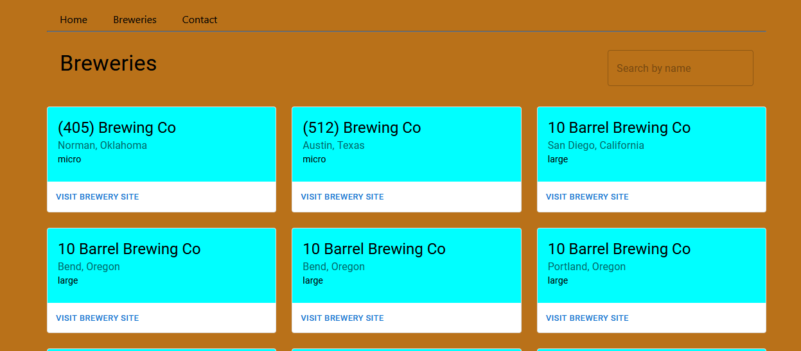

# Breweries App

This is a web application that allows users to search for breweries using the [Open Brewery DBAPI](https://www.openbrewerydb.org/documentation). Click [here](https://the-breweries-app.netlify.app) to view app.



## Features

* Search for breweries by name
* View brewery details, including location on map.

## Technologies Used

* React: A popular JavaScript library for building user interfaces

* Leaflet: An open-source library for interactive maps

* Axios: A promise-based HTTP client for making API requests

* Material-UI: A popular React UI framework for building responsive and customizable user interfaces

## Setup 

1. Clone the repository to your local machine using the command 

```
    https://github.com/SamAddy/fs15_8-breweries-app.git
```
2. Install the dependencies by running npm install in the project directory.

3. Start the development server with the command npm start.

4. Open your web browser and go to http://localhost:3000 to view the application.

## Usage

To search for breweries, simply type the name of the brewery you're looking for in the search bar and press enter. The results will be displayed on the page. Clicking on a brewery will display its details, including its location on a map. You may also search by id with the url in the form /breweries/id.
For example `http://localhost:3000/breweries/b54b16e1-ac3b-4bff-a11f-f7ae9ddc27e0`
